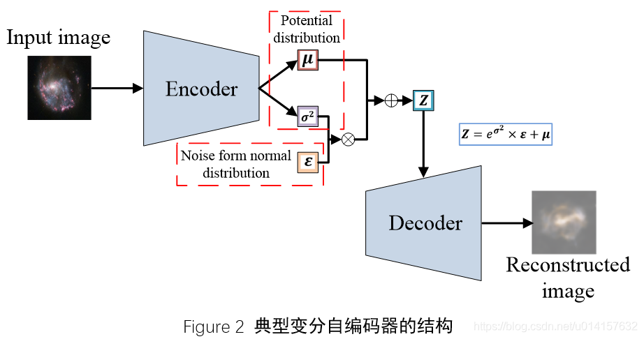
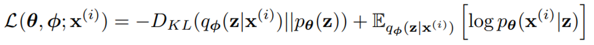
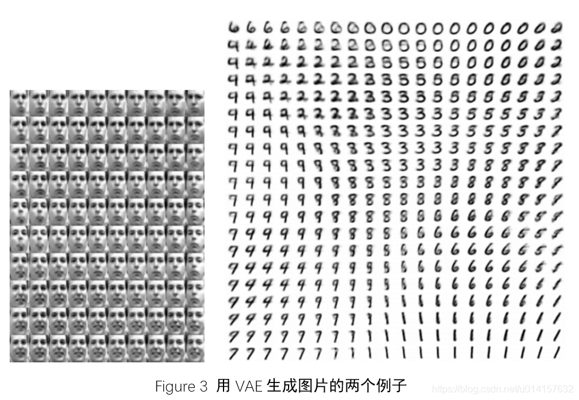
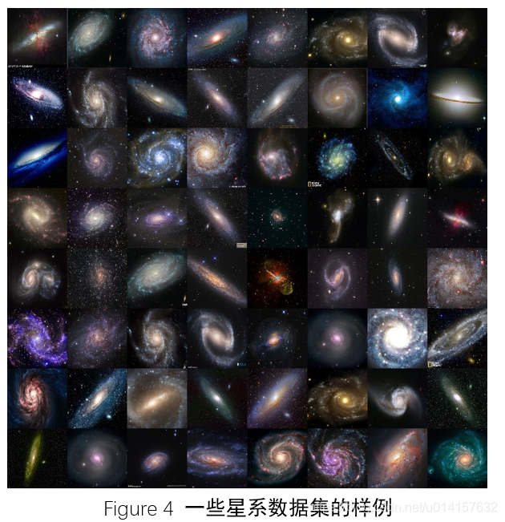
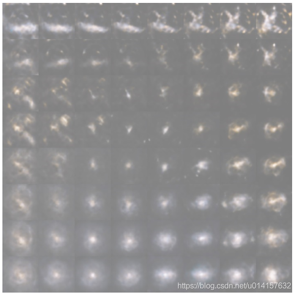

# 用深度学习生成星辰大海

> 相信大家对浩瀚的宇宙、漫天繁星都充满过极大的兴趣，我们对夜晚漫天眨眼的星星充满了无限的向往，在某个夏日夜晚里，我们也是那个“数星星的孩子”。在本项目，我们将使用变分自编码器（VAE）这项深度学习技术，生成星系的图片，生成我们的“星辰大海”。

## 变分自编码器

自编码器（AutoEncoder）是一种表示学习技术，是深度学习中的一个重要分支，也是无监督学习的重要技术之一。一个典型的自编码器结构如Figure1所示，包括两个主要部分：编码器（Encoder）和解码器（Decoder）。编码器将输入图像不断压缩，最后形成一个特征表示向量，而解码器用这个表示向量将原图片重构出来。学习过程是最小化输出与输入之间的差异，这个差异用一个损失函数表示，比如均方误差。自编码器起到了降维的作用，用一个低维的向量空间来表示原始的高维空间。

而变分自编码器是怎么回事呢？先看一下典型的变分自编码的结构，如图2所示。

看上去很复杂，在编码器和解码器之间已经不是那个简单的特征表示向量了。作为生成式模型，VAE和生成式对抗网络GAN比较相似：都是希望通过一个隐变量$Z$生成数据$x$，使生成数据的分布$p(x|z)$接近于真实分布$p(x)$。假设$z$服从某种分布，比如正态分布。GAN直接由$Z$生成数据，和真实数据进行对抗训练。而VAE直接从输入数据中学习这种分布。我们现在假设$Z$服从标准正态分布，它有两个参数，均值$\boldsymbol{\mu}$和方差$\boldsymbol{\sigma}^2$。从图2中可看出，编码器就是来干这个事情的，它会拟合出均值$\boldsymbol{\mu}$和方差的对数$\log \boldsymbol{\sigma}$。这里不直接拟合$\boldsymbol{\sigma}^2$是因为$\boldsymbol{\sigma}^2$是非负的，需要加激活函数，而$\log \boldsymbol{\sigma}$就可正可负了，不需要加激活函数。

由于$Z$要从$N(\boldsymbol{\mu}, \boldsymbol{\sigma}^2)$中采样，但这个采样的过程是不可导的，无法使用反向传播算法。对于这个问题，这里采用了reparameterization的技巧，即从$N(\boldsymbol{0},\boldsymbol{I})$中采样一个$\boldsymbol{\epsilon}$，然后令$\boldsymbol{Z}=\boldsymbol{\sigma}^2 \times \boldsymbol{\epsilon}+\boldsymbol{\mu}$，这样$Z$依然服从$N(\boldsymbol{\mu}, \boldsymbol{\sigma}^2)$，而这个过程是线性的，可以正常使用反向传播算法。

现在$Z$服从正态分布$N(\boldsymbol{\mu}, \boldsymbol{\sigma}^2)$，为了使$Z$服从标准正态分布$N(\boldsymbol{0}, \boldsymbol{I})$，我们将$N(\boldsymbol{\mu}, \boldsymbol{\sigma}^2)$与$N(\boldsymbol{0}, \boldsymbol{I})$的KL散度作为损失函数的一项，即正则化项，使Z趋向于标准正态分布。损失函数的另一项就是重构损失了，由于要使生成数据的分布$p(x|z)$接近于真实分布$p(x)$，所以这里使用两者的交叉熵损失作为重构损失。最后整个损失函数为：

那么说了这么多，VAE和普通的自编码器相比有什么优点呢？普通的自编码器更关注对原始数据的重构，生成的特征表示也是不连续的，那么如果从一片未学到的隐空间进行采样再进过解码器后，生成的数据可能是不真实的。而VAE学习到的是数据的分布，隐空间是连续的，可以从这个空间随意采样。下图是两个用VAE生成图片的例子。左边的图片是生成人脸，第一行从左往右看，人脸从朝右慢慢变成了朝左，往下看，人脸从面无表情慢慢变成了微笑。右边是生成的手写数字，从第一行向右看，数字从6慢慢变成了0，往下看，数字6慢慢变成了9，整个生成的图片都是渐变的。所以用VAE生成的图片可以有渐变的特性。

## 使用星系数据集实践VAE

这里我们想要生成星系的图片，但没有这样的公开数据集，所以我自己从网上爬取了一些星系的图片，经过筛选与处理，最后得到了600多张图片。600多张说实话确实太少了，但质量比较高的关于星系的图片比较少，网上爬取的图片很多也都是重复的。这里我们用这个星系数据集为例，能使模型work起来，结果看得过去就算成功。

我收集到的星系数据集的一些样例如下图所示：

星系本身是非常漂亮的~

下面是模型设计，这里我们使用全卷积网络（FCN）作为编码器，解码器结构与之对称。全卷积网络没有池化层，池化层使用带步长的卷积代替，这样可以让网络自己学习到合适的下采样策略。编码器encoder与解码器decoder的结构如表1和表2所示。编码器中有4层卷积，滤波器通道数目逐渐增加，已学到更丰富的特征。然后最后一层卷积的输出被展开成一维向量，分成两个支路，一个支路表示均值向量$\boldsymbol{\mu}$，另一个支路表示$\log \boldsymbol{\sigma}^2$。这里设它们是4维的。对于解码器，基本上使编码器的对称。由于编码器中图像经过卷积后尺寸是慢慢变小的，在解码器中用上采用层将图片慢慢变大。而通道数目是逐渐减少的，将丰富的信息逐渐整合成RGB三通道的图像。最后一层的激活函数是tanh函数，值在-1和1之间，会将其线性变换至0到255之间的整数。整个网络的输入输出均为$256 \times 256 \times 3$的图像。

最后是实验结果，下图是训练结束后生成的图像：

从上图中可以看出VAE已经学习到了星系相关的形状，从左上角向右看，形状由棒形变为不规则形状，向下看变为团状，颜色也是渐变的。不过缺点也是很明显的：不够清晰。这里有两个原因吧：第一是VAE生成图片的清晰度不如GAN，依靠对抗训练GAN可以获得高清晰度的图片。第二是数据量不够，只有600多张图片，模型能学习到的信息很有限，增加数据量可以进一步提高效果。

## 参考资料

[1] Kingma, D. P., & Welling, M. (2013). Auto-encoding variational bayes. arXiv preprint arXiv:1312.6114.

[2] 苏剑林. (2018, Mar 18). 《变分自编码器（一）：原来是这么一回事 》[Blog post]. Retrieved from https://spaces.ac.cn/archives/5253

[3] https://www.cnblogs.com/fxjwind/p/9099931.html

